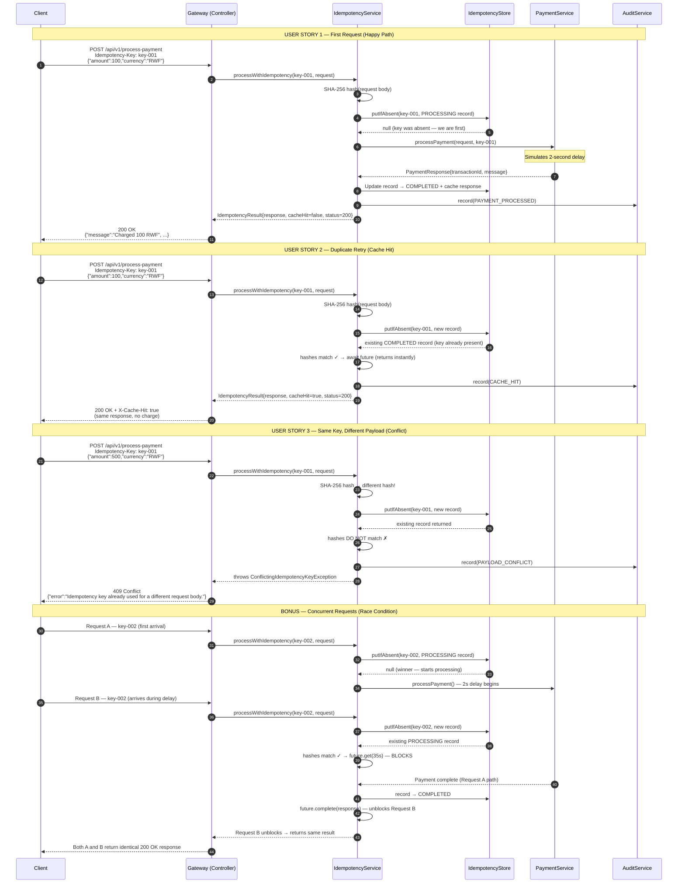
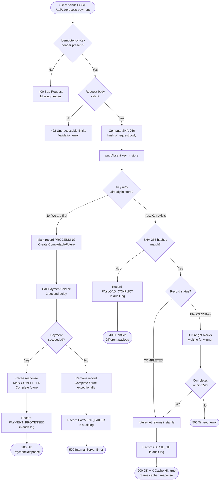

# IgirePay Idempotency Gateway

> **Production-grade "Pay-Once" middleware for IgirePay Technologies Ltd.**
> Guarantees that every payment request is processed **exactly once**, no matter how many times a client retries.

---

## Table of Contents

1. [Project Overview](#1-project-overview)
2. [Architecture](#2-architecture)
3. [Sequence Diagram](#3-sequence-diagram)
4. [Decision Flowchart](#4-decision-flowchart)
5. [Tech Stack](#5-tech-stack)
6. [Project Structure](#6-project-structure)
7. [Setup & Running](#7-setup--running)
8. [API Documentation](#8-api-documentation)
9. [curl Examples](#9-curl-examples)
10. [Design Decisions](#10-design-decisions)
11. [Concurrency Handling](#11-concurrency-handling)
12. [Developer's Choice — Audit Logging](#12-developers-choice--audit-logging)
13. [Future Improvements](#13-future-improvements)

---

## 1. Project Overview

### The Business Problem

IgirePay Technologies Ltd. processes payments for e-commerce merchants across Rwanda and East Africa. When a client's network times out after sending a payment request, their system automatically retries — causing IgirePay to process the payment twice and double-charge the customer.

This results in:
- Customer complaints and churn
- Regulatory violations (BNR compliance)
- Manual refund overhead

### The Solution

This service is an **Idempotency Gateway** — a middleware layer that sits in front of the payment processor and guarantees:

| Scenario | Behaviour |
|---|---|
| First request with a new key | Process payment, cache the response |
| Retry with same key + same payload | Return cached response instantly — no charge |
| Same key + different payload | Reject with 409 Conflict |
| Two identical requests at the same time | Second request waits; both return the same result |

---

## 2. Architecture

```
Client (e-commerce store)
        │
        │  POST /api/v1/process-payment
        │  Header: Idempotency-Key: <uuid>
        │  Body:   { "amount": 100, "currency": "RWF" }
        ▼
┌──────────────────────────────────────┐
│         PaymentController            │  ← Thin REST layer
│  Validates header, delegates, sets   │
│  X-Cache-Hit response header         │
└──────────────┬───────────────────────┘
               │
               ▼
┌──────────────────────────────────────┐
│       IdempotencyServiceImpl         │  ← Core business logic
│  1. Hash request body (SHA-256)      │
│  2. putIfAbsent into store           │
│  3. Route to correct path            │
│  4. Record audit event               │
└───────┬──────────────┬───────────────┘
        │              │
        ▼              ▼
┌───────────────┐  ┌──────────────────────┐
│ IdempotencyStore│  │  PaymentServiceImpl  │
│ ConcurrentHashMap│  │  Simulates 2s delay │
│ + TTL Eviction │  │  Returns response    │
└───────────────┘  └──────────────────────┘
        │
        ▼
┌──────────────────────────────────────┐
│          AuditServiceImpl            │  ← Developer's Choice
│  Records every event to an           │
│  in-memory ConcurrentLinkedDeque     │
│  Queryable via GET /api/v1/audit     │
└──────────────────────────────────────┘
```

---

## 3. Sequence Diagram



---

## 4. Decision Flowchart



---

## 5. Tech Stack

| Technology | Version | Purpose |
|---|---|---|
| Java | 17 | Primary language |
| Spring Boot | 3.2.5 | Application framework |
| Maven | 3.x | Build tool |
| ConcurrentHashMap | JDK built-in | Thread-safe idempotency store |
| CompletableFuture | JDK built-in | Concurrent request synchronisation |
| SHA-256 (MessageDigest) | JDK built-in | Request body hashing |
| Lombok | Latest | Boilerplate elimination |
| Spring Validation | 3.2.5 | DTO validation (`@Valid`) |
| Spring Actuator | 3.2.5 | Health and metrics endpoints |
| Micrometer | Latest | Metrics instrumentation |
| SLF4J / Logback | Built-in | Structured application logging |

> **No external database required.** The system runs with a single `java -jar` command.

---

## 6. Project Structure

```
igire-idempotency-gateway/
├── pom.xml
└── src/
    └── main/
        ├── java/rw/igirepay/gateway/
        │   ├── IgirePayGatewayApplication.java   ← Entry point + @EnableScheduling
        │   ├── config/
        │   │   ├── IdempotencyProperties.java     ← TTL and eviction config binding
        │   │   └── PaymentProperties.java         ← Processing delay config binding
        │   ├── controller/
        │   │   ├── PaymentController.java         ← POST /api/v1/process-payment
        │   │   └── AuditController.java           ← GET /api/v1/audit/*
        │   ├── dto/
        │   │   ├── PaymentRequest.java            ← Inbound payload (BigDecimal amount)
        │   │   ├── PaymentResponse.java           ← Outbound payload
        │   │   ├── IdempotencyResult.java         ← Internal service result wrapper
        │   │   └── ErrorResponse.java             ← Standardised error envelope
        │   ├── exception/
        │   │   ├── GlobalExceptionHandler.java    ← @RestControllerAdvice
        │   │   ├── MissingIdempotencyKeyException.java  ← 400
        │   │   ├── ConflictingIdempotencyKeyException.java ← 409
        │   │   └── PaymentProcessingException.java      ← 500
        │   ├── model/
        │   │   ├── IdempotencyRecord.java         ← Core cache entity
        │   │   ├── IdempotencyStatus.java         ← PROCESSING / COMPLETED
        │   │   ├── AuditEvent.java                ← Immutable audit record
        │   │   └── AuditEventType.java            ← Event categories
        │   ├── service/
        │   │   ├── IdempotencyService.java        ← Interface
        │   │   ├── PaymentService.java            ← Interface
        │   │   ├── AuditService.java              ← Interface
        │   │   └── impl/
        │   │       ├── IdempotencyServiceImpl.java ← Core idempotency engine
        │   │       ├── PaymentServiceImpl.java     ← Simulated payment processor
        │   │       └── AuditServiceImpl.java       ← In-memory audit log
        │   ├── store/
        │   │   └── IdempotencyStore.java          ← ConcurrentHashMap + TTL eviction
        │   └── util/
        │       └── HashUtil.java                  ← SHA-256 hashing
        └── resources/
            └── application.yml                    ← All configuration
```

---

## 7. Setup & Running

### Prerequisites

- Java 17 or higher
- Maven 3.6+

Verify your environment:
```bash
java -version   # must be 17+
mvn -version    # must be 3.6+
```

### Clone and Run

```bash
# 1. Clone the repository
git clone https://github.com/ESTHERUWAMWEZI/SheCanCode-associate-Assessment-.git
cd igire-idempotency-gateway

# 2. Build the project
mvn clean package -DskipTests

# 3. Run the application
mvn spring-boot:run
```

The server starts on **http://localhost:8080**

You should see:
```
Started IgirePayGatewayApplication in X.XXX seconds
```

### Run as a JAR (production style)

```bash
mvn clean package -DskipTests
java -jar target/igire-idempotency-gateway-1.0.0.jar
```

### Health Check

```bash
curl http://localhost:8080/actuator/health
```
```json
{
  "status": "UP"
}
```

### Configuration (`application.yml`)

| Property | Default | Description |
|---|---|---|
| `igirepay.idempotency.ttl-minutes` | `30` | How long a key is remembered |
| `igirepay.idempotency.eviction-interval-ms` | `60000` | How often expired keys are cleaned up |
| `igirepay.payment.processing-delay-ms` | `2000` | Simulated payment processing time |
| `server.port` | `8080` | HTTP port |

---

## 8. API Documentation

### Base URL

```
http://localhost:8080/api/v1
```

---

### `POST /process-payment`

Processes a payment request. Idempotency is guaranteed via the `Idempotency-Key` header.

**Request Headers**

| Header | Required | Description |
|---|---|---|
| `Idempotency-Key` | Yes | Unique client-generated string (e.g. UUID) |
| `Content-Type` | Yes | `application/json` |

**Request Body**

```json
{
  "amount": 100,
  "currency": "RWF"
}
```

| Field | Type | Constraints |
|---|---|---|
| `amount` | `BigDecimal` | Required, greater than 0 |
| `currency` | `String` | Required, exactly 3 characters (ISO 4217) |

**Response — First Request (200 OK)**

```json
{
  "message": "Charged 100 RWF",
  "transactionId": "A1B2C3D4-...",
  "idempotencyKey": "pay-order-789",
  "status": "SUCCESS",
  "amount": "100",
  "currency": "RWF",
  "processedAt": "2026-05-24T10:30:00"
}
```

**Response — Duplicate Request (200 OK + cache header)**

Same body as above, plus:
```
X-Cache-Hit: true
```

**Error Responses**

| Status | Trigger | Message |
|---|---|---|
| `400` | Missing `Idempotency-Key` header | `"The 'Idempotency-Key' request header is required."` |
| `409` | Same key, different request body | `"Idempotency key already used for a different request body."` |
| `422` | Invalid request body (missing fields, bad values) | Field-level validation message |
| `500` | Payment processing failure or timeout | Error detail |


### `GET /audit`

Returns all recorded gateway events, most recent first.

**Response (200 OK)**
```json
[
  {
    "eventId": "uuid",
    "idempotencyKey": "pay-order-789",
    "eventType": "CACHE_HIT",
    "amount": "100",
    "currency": "RWF",
    "description": "Duplicate request served from cache. No charge applied.",
    "requestBodyHash": "a3f5c2...",
    "timestamp": "2026-05-24T10:30:05"
  }
]
```


### `GET /audit/{key}`

Returns all events for a specific idempotency key.


### `GET /audit/stats`

Returns event counts grouped by type — powers a monitoring dashboard.

**Response (200 OK)**
```json
{
  "PAYMENT_PROCESSED": 42,
  "CACHE_HIT": 18,
  "PAYLOAD_CONFLICT": 3,
  "PAYMENT_FAILED": 1,
  "MISSING_IDEMPOTENCY_KEY": 5
}
```


## 9. curl Examples

### User Story 1 — First Request

```bash
curl -X POST http://localhost:8080/api/v1/process-payment \
  -H "Content-Type: application/json" \
  -H "Idempotency-Key: pay-order-001" \
  -d '{"amount": 100, "currency": "RWF"}'
```

Expected response (after ~2 seconds):
```json
{
  "message": "Charged 100 RWF",
  "transactionId": "A1B2C3D4-E5F6-...",
  "idempotencyKey": "pay-order-001",
  "status": "SUCCESS",
  "amount": "100",
  "currency": "RWF",
  "processedAt": "2026-05-24T10:30:00"
}
```


### User Story 2 — Duplicate Request (instant cache hit)

```bash
curl -v -X POST http://localhost:8080/api/v1/process-payment \
  -H "Content-Type: application/json" \
  -H "Idempotency-Key: pay-order-001" \
  -d '{"amount": 100, "currency": "RWF"}'
```

Expected (returns immediately — no 2-second delay):
```
< HTTP/1.1 200
< X-Cache-Hit: true
```
```json
{
  "message": "Charged 100 RWF",
  "transactionId": "A1B2C3D4-E5F6-..."
}
```


### User Story 3 — Same Key, Different Payload (conflict)

```bash
curl -X POST http://localhost:8080/api/v1/process-payment \
  -H "Content-Type: application/json" \
  -H "Idempotency-Key: pay-order-001" \
  -d '{"amount": 500, "currency": "RWF"}'
```

Expected:
```json
{
  "status": 409,
  "error": "Conflict",
  "message": "Idempotency key already used for a different request body.",
  "path": "/api/v1/process-payment",
  "traceId": "uuid",
  "timestamp": "2026-05-24T10:30:10"
}
```


### Missing Header

```bash
curl -X POST http://localhost:8080/api/v1/process-payment \
  -H "Content-Type: application/json" \
  -d '{"amount": 100, "currency": "RWF"}'
```

Expected:
```json
{
  "status": 400,
  "error": "Bad Request",
  "message": "The 'Idempotency-Key' request header is required.",
  "traceId": "uuid"
}
```


### View Audit Trail

```bash
# All events
curl http://localhost:8080/api/v1/audit

# Events for a specific key
curl http://localhost:8080/api/v1/audit/pay-order-001

# Dashboard stats
curl http://localhost:8080/api/v1/audit/stats
```


## 10. Design Decisions

### `BigDecimal` for monetary amounts

`double` and `float` use IEEE 754 binary floating-point arithmetic, which cannot represent all decimal fractions exactly. For example, `0.1 + 0.2` evaluates to `0.30000000000000004` in binary floating-point. In a payment system, this is a regulatory defect. `BigDecimal` performs exact decimal arithmetic — required by any financial application.

### `ConcurrentHashMap` over `synchronized HashMap`

`ConcurrentHashMap` uses lock-striping (Java 8+: lock-free reads via volatile + CAS writes). Multiple threads can read different keys simultaneously; only writes to the same hash bucket contend. This is significantly higher throughput than a fully-synchronized `HashMap` for a gateway that serves many concurrent clients.

### `putIfAbsent` as the concurrency primitive

The entire thread-safety guarantee is a single atomic `putIfAbsent()` call. If two threads arrive for the same key simultaneously, exactly one wins the insertion race — the other receives the existing record and waits. No explicit `Lock`, `synchronized`, or `Semaphore` is needed. This keeps the code simple and eliminates deadlock risk.

### SHA-256 for payload comparison

Storing the raw request body would consume unbounded memory as payloads grow. A SHA-256 hash is always 64 hex characters regardless of payload size. SHA-256 is collision-resistant: the probability of two different payloads producing the same hash is approximately 1 in 2^128 — effectively zero for any practical payment volume.

Jackson serialises the `PaymentRequest` object to JSON before hashing, normalising field order. This ensures `{"amount":100,"currency":"RWF"}` and `{"currency":"RWF","amount":100}` produce identical hashes.

### Interface-based service layer

Every service is defined as an interface (`PaymentService`, `IdempotencyService`, `AuditService`) with a concrete implementation in `impl/`. This means:
- `PaymentServiceImpl` can be replaced with a real MTN MoMo / Stripe adapter with zero changes to the controller or idempotency layer.
- `IdempotencyStore` can be replaced with a Redis adapter for horizontal scaling.
- Each layer is independently unit-testable with mocks.

### TTL-based record expiration

Without TTL, the `ConcurrentHashMap` grows indefinitely. After 30 minutes (configurable), idempotency records are evicted by a `@Scheduled` background task. This means a client who retries after 30 minutes gets a fresh processing — reasonable for payment systems where retries happen within seconds or minutes of the original request.


## 11. Concurrency Handling

### The Problem

Two clients send identical requests at exactly the same time for the same `Idempotency-Key`. Without proper handling, both could pass the "key exists?" check simultaneously and trigger two payments.

### The Solution

```
Thread A (winner)                     Thread B (loser)
─────────────────────────────────     ─────────────────────────────────
putIfAbsent(key, record) → null       putIfAbsent(key, record) → existing
[Wins the atomic race]                [Loses the atomic race]
processPayment() — 2 seconds          future.get(35s) — BLOCKS HERE
future.complete(response)         →   [UNBLOCKS — receives same response]
returns result (cacheHit=false)       returns result (cacheHit=true)
```

**Why `CompletableFuture`?**

The losing thread does not busy-wait or poll. `CompletableFuture.get()` is a blocking wait that releases the thread to the OS scheduler — zero CPU consumption while waiting. When the winning thread calls `future.complete(response)`, Java's happens-before guarantee ensures Thread B sees all memory writes made by Thread A before the completion. This makes the response correctly visible without any additional `volatile` reads or locks.

**Why not `synchronized`?**

`synchronized(key)` would require locking on the String object, which is error-prone (String interning, different instances). It also holds the lock for the entire 2-second processing duration, blocking all other concurrent requests to different keys in the same `synchronized` block. The `CompletableFuture` approach only "waits" per key, not globally.


## 12. Developer's Choice — Audit Logging

### Feature

Every gateway event — successful payment, cache hit, conflict, failure, missing header — is recorded to a structured, queryable audit trail.

### Why Audit Logging?

In Rwanda, the National Bank (BNR) requires payment processors to maintain records of all financial transactions for a minimum of 5 years. PCI-DSS (the global card payment security standard) additionally requires audit trails for all access to cardholder data environments.

Beyond compliance, audit logging answers the most common support question in payments: **"My customer says they were charged twice — what happened?"**

With this system, the support engineer runs:
```bash
curl http://localhost:8080/api/v1/audit/pay-order-001
```

And immediately sees the full event timeline: when the first request arrived, whether a cache hit occurred, what the transaction ID was, and whether any conflict or failure was detected. No log grep required.

### Implementation

| Component | Technology | Reason |
|---|---|---|
| `AuditServiceImpl` | `ConcurrentLinkedDeque` | Thread-safe, ordered, non-blocking insertions from concurrent request threads |
| Event cap | 10,000 records | Prevents unbounded memory growth; oldest events evicted first |
| Structured logging | SLF4J at INFO level | Events appear in application logs AND the in-memory store simultaneously |
| `AuditController` | Spring REST | `GET /audit`, `GET /audit/{key}`, `GET /audit/stats` |

### Audit Event Types

| Type | Meaning |
|---|---|
| `PAYMENT_PROCESSED` | First request — payment charged successfully |
| `CACHE_HIT` | Duplicate retry — cached response returned, no charge |
| `PAYLOAD_CONFLICT` | Same key, different body — request rejected |
| `PAYMENT_FAILED` | Payment processing error |
| `MISSING_IDEMPOTENCY_KEY` | Request arrived without the required header |

### Production Upgrade Path

The current implementation is in-memory. Replacing `AuditServiceImpl` with a JPA repository backed by PostgreSQL requires only swapping the bean — no changes to `IdempotencyServiceImpl` or the controller, because the `AuditService` interface decouples the consumers from the storage mechanism.


## 13. Future Improvements

| Improvement | Description |
|---|---|
| **Redis-backed store** | Replace `ConcurrentHashMap` with Redis for horizontal scaling across multiple gateway instances |
| **API Authentication** | Secure endpoints with API keys or JWT (Spring Security) |
| **Rate Limiting** | Per-client request rate limiting using a sliding window counter |
| **Webhook callbacks** | Notify merchants asynchronously when payment status changes |
| **Distributed tracing** | Integrate OpenTelemetry for end-to-end request tracing across microservices |
| **Persistent audit log** | Move `AuditServiceImpl` to a PostgreSQL-backed JPA repository |
| **Metrics dashboard** | Expose Micrometer counters (cache hit rate, conflict rate) to Prometheus + Grafana |
| **Retry-After header** | When a key is still PROCESSING, return `Retry-After: <seconds>` so clients know when to retry |


